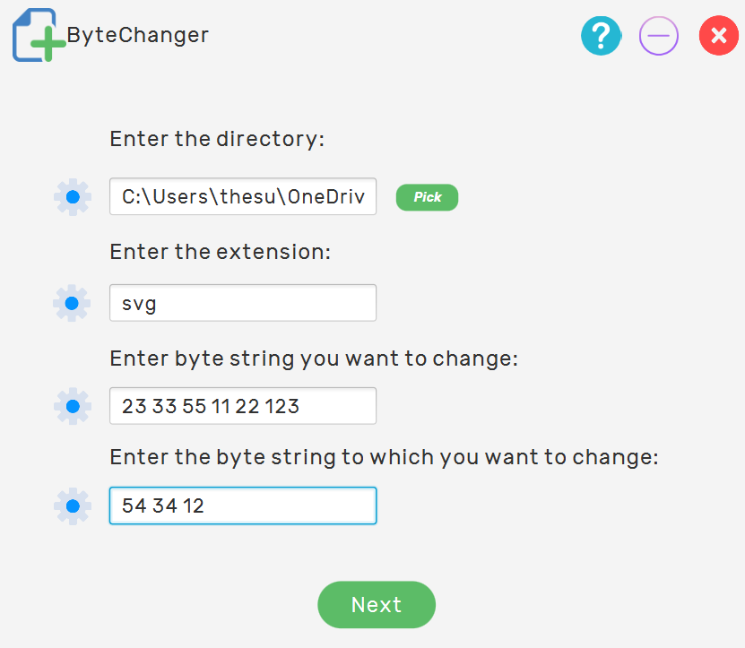
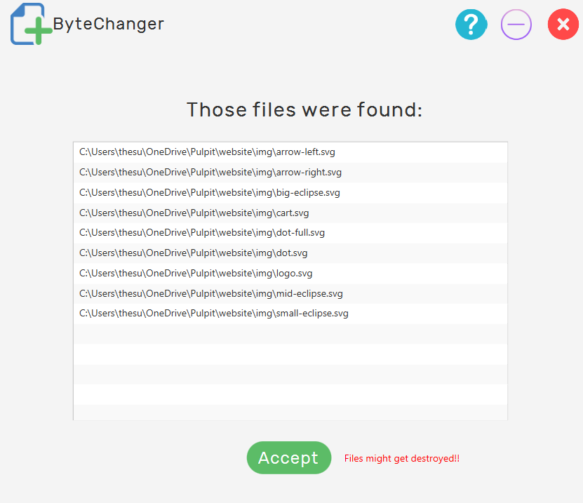
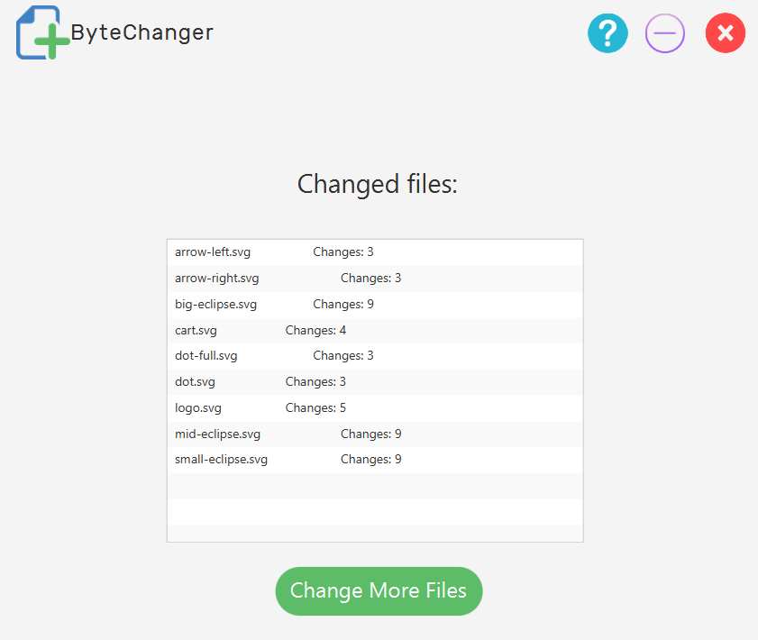

# QBS-Project

### Technologies
Mostly JavaFX, some CSS and HTML

### Quick note about code
Program is using Builder Design Pattern

### About program and how to use
Program gives us opportunity to modify bytes in every file in almost
every directory. We just have to enter directory, extension of the files and two string of bytes
first: which to replace second: replacement.

### Usage

1. We have to enter every information in correct form

2. We can see now which files the program found in this directory
  

   

3. And finally we see how many changes were made in every file we 
   listed
   

   
